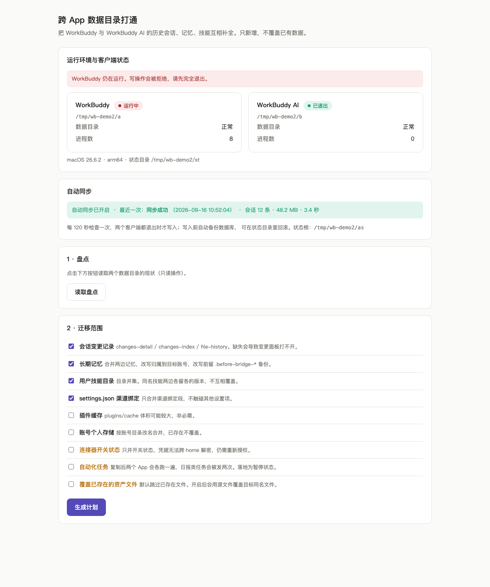

# wb-account-sync

<p align="center">
  <strong>WorkBuddy 账号数据安全迁移与跨 App 打通工具</strong><br>
  离线 · 显式确认 · 可回滚 · 零运行时依赖
</p>

<p align="center">
  
  
  
</p>

<p align="center">
  
</p>

> **非官方项目**，未获 WorkBuddy 或其厂商背书。仅用于你本人有权管理的账户。

---

## 目录

- [30 秒上手](#30-秒上手)
- [桌面应用（免装 Python）](#桌面应用免装-python)
- [它能做什么](#它能做什么)
- [安全模型](#安全模型)
- [两种使用方式](#两种使用方式)
  - [浏览器界面（推荐）](#浏览器界面推荐)
  - [命令行](#命令行)
- [安装](#安装)
- [测试](#测试)
- [文档](#文档)
- [免责声明](#免责声明)

---

## 30 秒上手

如果你本机同时装了 **WorkBuddy** 和 **WorkBuddy AI**，它们的数据互相隔离。
这个工具可以把两边的会话历史、记忆、技能、配置做**双向合并**，且不会覆盖任何已有数据。

```bash
git clone https://github.com/Guyungy/wb-account-sync.git
cd wb-account-sync
python3 tools/wb_ui.py
```

启动后会自动打开浏览器，界面会实时告诉你两个客户端是否已完全退出。
**只有退出后，「执行」按钮才会解锁。**

macOS 用户也可以直接双击 [`tools/ui.command`](tools/ui.command)，把它拖到 Dock 上当 App 用。

---

## 桌面应用（免装 Python）

不想装 Python、也不想碰终端，就下载现成的应用：

| 平台 | 文件 | 用法 |
|---|---|---|
| macOS | `wb-account-sync-macos.zip` | 解压出 `wb-account-sync.app`，拖进「应用程序」，双击 |
| Windows | `wb-account-sync-windows.zip` | 解压出 `wb-account-sync.exe`，双击 |

自带 Python 运行时，双击后打开独立桌面窗口。账号与用量面板支持本机账号一键切换；切换前会备份登录状态，历史会话保留在本机。

### 可选的服务器每日看板

`server/` 提供独立的 WorkBuddy Daily 扩展：保存每日签到、积分和成长任务快照，并提供仅限邀请的自助添加账号页面。受邀人通过自己的手机验证码授权，只能查看和管理自己添加的账号。管理员看板仍需原有密码。部署方式和隔离设计见 [server/README.md](server/README.md)。这部分是可选服务，不影响桌面版的本地数据同步。

两个系统首次打开都会拦一次（因为没买代码签名证书）：macOS 上**右键 → 打开**，
Windows 上点**「更多信息」→「仍要运行」**。

> **Windows 侧尚未在真机验证。** 数据目录与客户端进程名都是推断值，首次使用前
> 请先读 [`docs/DESKTOP_APP.md`](docs/DESKTOP_APP.md) 的「平台功能对照」——那里说明了
> 为什么这一点需要你手工核对一次。

---

## 它能做什么

| 场景 | 支持 | 说明 |
|---|---|---|
| **账号与用量面板** | ✅ | 只读。识别两个客户端的当前账号、本机全部历史账号、各自资产与累计积分消耗 |
| 同一客户端内改账号归属 | ✅ | 把旧账号下的普通会话过户给当前登录账号 |
| 两个独立客户端互相打通 | ✅ | WorkBuddy ↔ WorkBuddy AI，双向合并，两边都保留 |
| **自动同步（无人值守）** | ✅ | launchd 代理每 2 分钟检查一次，两个 App 都退出时自动写入 |
| 只新增、不覆盖 | ✅ | 冲突时保留目标侧，源侧不删除 |
| 迁移计划 + 人工确认 | ✅ | 浏览器/命令行里必须粘贴完整 `plan_id` |
| 撤销 / 回滚 | ✅ | 基于 undo journal 恢复 `user_id`；自动同步状态页也会给出回滚命令 |
| 查看**剩余**积分余额 | ❌ | 余额只存在客户端主进程内存里，本机不落盘，详见 [`docs/ACCOUNTS.md`](docs/ACCOUNTS.md) |
| 跨设备迁移 / 云端同步 | ❌ | 不在本工具范围内 |

---

## 安全模型

这是 **Alpha 预览版**，设计优先级是“保守”：

- **客户端退出保护**：写操作前必须完全退出 WorkBuddy 与 WorkBuddy AI。
- **漂移拒绝**：执行前会再次核对数据库 fingerprint，源数据变了直接拒绝。
- **完整确认（手动模式）**：不支持 `--yes`，必须人工粘贴 `plan_id`。
- **自动同步模式**：可选 launchd 代理；两个 App 都退出时才写入，写入前仍然先备份数据库，
  并保留 undo journal 与回滚命令。该模式会免去 `plan_id` 的人工确认，请按需启用。
- **不搬敏感项**：连接器凭据用各 home 的 `.master.key` 加密，跨 home 解不开，因此默认不搬；自动化任务默认不搬（避免两边各跑一遍）。
- **本地运行**：服务只监听 `127.0.0.1`，所有 API 都校验一次性 token。

> 本工具的 undo journal 是归属恢复，不是完整备份。迁移前请先自行备份。

---

## 两种使用方式

### 浏览器界面（推荐）

最直观，适合大多数人：

```bash
cd wb-account-sync
python3 tools/wb_ui.py              # 自动挑端口、自动开浏览器
./tools/ui.command                  # macOS：双击启动，可拖到 Dock
tools\ui.bat                        # Windows：双击启动（需已装 Python 3.10+）
```

页面流程：**读取盘点 → 勾选迁移范围 → 生成计划 → 审阅 plan_id → 粘贴确认 → 执行迁移 → 核验 / 回滚**。

链接形如 `http://127.0.0.1:8788/?t=<token>`，**`?t=` 是访问凭据**，缺失或错误都会 403；每次启动 token 会变，旧链接失效。

页面顶部还有一块**只读的「账号与用量」面板**：识别两个客户端当前登录的是谁、
本机历史上用过哪些账号、各自带多少会话/记忆/连接器，以及累计积分消耗与近 14 天趋势。
它不需要退出客户端，也不写任何数据。详见 [`docs/ACCOUNTS.md`](docs/ACCOUNTS.md)。

### 命令行

适合脚本、CI，或不想开浏览器：

```bash
# 跨 App 打通：备份 → 计划 → 确认 → 执行 → 核验
./tools/bridge-run.sh

# 同一客户端内改归属
wb-account-sync doctor --home ~/.workbuddy
wb-account-sync plan   --home ~/.workbuddy --source <旧账号UUID> --target <当前账号UUID> --output plan.json
wb-account-sync apply  --plan plan.json --state-dir ./state --confirm <plan_id>
```

### 自动同步（无人值守，仅 macOS）

不想每次手动点「执行」？装一个 launchd 代理，让它在**两个客户端都退出时自动同步**：

> Windows 上暂不可用：这套机制依赖 macOS 的 launchd，Windows 侧要改用任务计划程序
> （`schtasks`），尚未实现。打包版也不含这个安装器——它依赖 `tools/wb_autosync.py` 的路径。
> Windows 上其余功能（盘点 / 计划 / 备份 / 执行 / 核验 / 回滚）不受影响，手动执行即可。

```bash
python3 tools/wb_autosync.py install --interval 120   # 默认每 120 秒检查一次
```

- 两个 App 都在运行时，代理**只查一次 `ps` 就退出**，不碰任何数据。
- 只有当它确认两个 App 都退出了，才会走「备份 → 生成计划 → 漂移校验 → 执行 → 核验」的完整流程。
- 免去的是「粘 plan_id、开终端」这些动作；安全机制（漂移拒绝、数据库备份、undo journal）一个没少。
- 浏览器界面会实时显示最近一次同步结果、会话数、回滚命令。

常用管理：

```bash
python3 tools/wb_autosync.py status     # 查看状态
python3 tools/wb_autosync.py pause      # 暂停
python3 tools/wb_autosync.py resume     # 恢复
python3 tools/wb_autosync.py run-now    # 立刻触发一次
python3 tools/wb_autosync.py uninstall  # 卸载（保留日志与历史运行记录）
```

> ⚠️ 自动同步会免去 `plan_id` 的人工确认。如果你对写入非常谨慎，建议只装、不执行，
> 用 `pause` 把它当「暂停的守护进程」，自己手动点界面里的「执行」。

详细用法见 [`docs/HOME_BRIDGE.md`](docs/HOME_BRIDGE.md) 与 [`docs/SAFETY.md`](docs/SAFETY.md)。

---

## 安装

### 方式零：下载桌面应用（免装 Python）

见上文 [桌面应用（免装 Python）](#桌面应用免装-python)——自带 Python 运行时，双击即用。

### 方式一：下载 wheel（推荐体验）

从 [Releases](https://github.com/Guyungy/wb-account-sync/releases) 下载标为 **Pre-release** 的 wheel 与 `SHA256SUMS.txt`，校验后安装：

```bash
python3 -m venv .venv
. .venv/bin/activate
python3 -m pip install --no-index --no-deps ./wb_account_sync-0.3.0a1-py3-none-any.whl
wb-account-sync --version
```

### 方式二：从源码安装

```bash
git clone https://github.com/Guyungy/wb-account-sync.git
cd wb-account-sync
python3 -m venv .venv
. .venv/bin/activate
python3 -m pip install .
```

**尚未发布 PyPI**，不要假设 `pip install wb-account-sync` 下载的是本项目。

---

## 测试

```bash
python3 -m unittest discover -s tests -v
python3 tools/synth_check.py      # 跨 App 桥端到端（25 项）
python3 tools/autosync_check.py   # 自动同步层端到端（10 项）
```

- 单元测试：125 项，覆盖只读零副作用、计划漂移、权限拒绝、journal 中断续办、幂等、撤销等。
- `tools/synth_check.py`：25 项端到端断言，用真实 schema 造两个假 home，验证 survey / plan / apply / verify / restore 全链路。
- `tools/autosync_check.py`：10 项断言，验证自动同步的跳过/变化检测/幂等/备份/暂停/并发锁/清理/plist 生成。

---

## 文档

- [`docs/DESKTOP_APP.md`](docs/DESKTOP_APP.md) — 桌面应用：下载、首次放行、平台差异与自行构建
- [`docs/HOME_BRIDGE.md`](docs/HOME_BRIDGE.md) — 跨 App 数据目录打通与自动同步详细说明
- [`docs/ACCOUNTS.md`](docs/ACCOUNTS.md) — 账号与用量面板：能读什么、为什么拿不到余额、跨客户端去重口径
- [`docs/SAFETY.md`](docs/SAFETY.md) — 安全边界及故障处理
- [`docs/ROADMAP.md`](docs/ROADMAP.md) — 长期路线图与 1.0 验收
- [`docs/MIGRATION.md`](docs/MIGRATION.md) — 从旧版迁移
- [`CHANGELOG.md`](CHANGELOG.md) — 更新记录

---

## 免责声明

- 本项目非官方，与 WorkBuddy 及其厂商无关联。
- 仅用于你本人拥有完整管理权限的账户和数据。
- 客户端私有存储协议、界面展示和云同步行为尚未经过正式兼容认证。
- 0.3.0a1 是安全预览版，不是生产稳定版。不要在不可替代的数据上首次运行。

### 许可证

**GNU General Public License v3.0 or later**（GPL-3.0-or-later）

Copyright (C) 2026 Guyungy

本程序是自由软件：你可以依据自由软件基金会发布的 GNU 通用公共许可证条款
（许可证第 3 版，或你选择的任何更新版本）重新分发和/或修改它。

本程序分发的目的是希望它有用，但不提供任何担保，甚至不包含适销性或
特定用途适用性的默示担保。详见 [GNU 通用公共许可证](LICENSE)。

> 采用 GPL 意味着：**衍生作品必须以相同许可证开源**。如果你需要闭源商用，
> 请联系作者另行授权。
